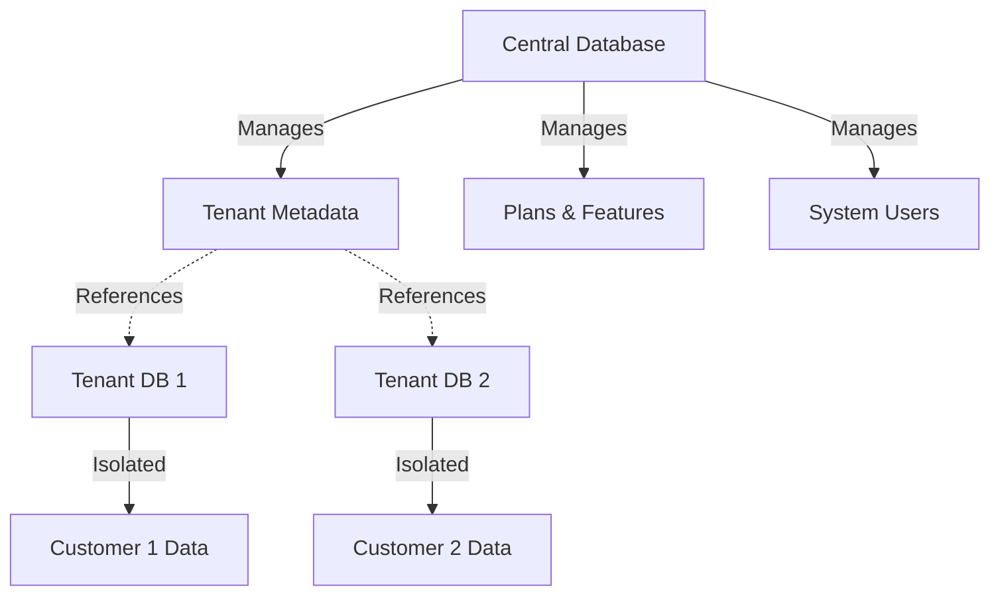

The SaaS Starter Vue project follows Laravel and Vue.js best practices with a clear separation between system-level (multi-tenant management) and tenant-level (individual customer) functionality.

## Root Directory

```
saas-starter-vue/
├── app/                    # Laravel application code
├── bootstrap/              # Framework bootstrap files
├── config/                 # Configuration files
├── database/               # Migrations, seeders, and factories
├── public/                 # Public assets (compiled)
├── resources/              # Frontend source code
├── routes/                 # Route definitions
├── storage/                # Application storage
├── tests/                  # Test suites
├── vendor/                 # Composer dependencies
├── node_modules/           # NPM dependencies
├── composer.json           # PHP dependencies
├── package.json            # JavaScript dependencies
├── vite.config.ts          # Vite configuration
└── phpunit.xml             # PHPUnit configuration
```

## Backend Structure (`app/`)

The Laravel backend is organized into logical namespaces that separate system and tenant concerns:

### Key Directories

<AccordionGroup>
  <Accordion title="app/Actions/">
    Custom action classes for specific business logic.
    
    ```
    app/Actions/
    └── Fortify/
        ├── CreateNewUser.php
        └── ResetUserPassword.php
    ```
    
    These handle authentication flows like user registration and password resets.
  </Accordion>

  <Accordion title="app/Http/Controllers/">
    Controllers organized by domain (System vs Tenant).
    
    ```
    app/Http/Controllers/
    ├── Controller.php              # Base controller
    ├── System/                     # Multi-tenant management
    │   ├── DashboardController.php
    │   ├── PlanController.php
    │   ├── TenantController.php
    │   └── Settings/
    │       ├── ProfileController.php
    │       ├── PasswordController.php
    │       └── TwoFactorAuthenticationController.php
    └── Tenant/                     # Customer application
        ├── DashboardController.php
        └── Auth/
            └── LoginController.php
    ```
  </Accordion>

  <Accordion title="app/Models/">
    Eloquent models split by system and tenant databases.
    
    ```
    app/Models/
    ├── System/                # Central database models
    │   ├── User.php           # System administrators
    │   ├── Tenant.php         # Customer organizations
    │   ├── Plan.php           # Subscription plans
    │   ├── Feature.php        # Plan features
    │   ├── Subscription.php   # Tenant subscriptions
    │   └── Setting.php        # System settings
    └── Tenant/                # Tenant database models
        └── User.php           # Tenant users
    ```
    
    **Important**: System models connect to the central database, while Tenant models live in isolated tenant databases.
  </Accordion>

  <Accordion title="app/Services/">
    Business logic and complex operations.
    
    ```
    app/Services/
    └── System/
        ├── TenantService.php       # Tenant lifecycle management
        ├── PlanService.php         # Plan operations
        ├── FeatureService.php      # Feature management
        └── SubscriptionService.php # Subscription handling
    ```
  </Accordion>
</AccordionGroup>

### Example: System Model

The `Tenant` model demonstrates the multi-tenant architecture:

```php app/Models/System/Tenant.php
namespace App\Models\System;

use Stancl\Tenancy\Database\Models\Tenant as BaseTenant;
use Stancl\Tenancy\Contracts\TenantWithDatabase;
use Stancl\Tenancy\Database\Concerns\HasDatabase;
use Stancl\Tenancy\Database\Concerns\HasDomains;

class Tenant extends BaseTenant implements TenantWithDatabase
{
    use HasDatabase, HasDomains;

    protected $casts = [
        'subscription_ends_at' => 'datetime',
        'trial_ends_at' => 'datetime',
        'canceled_at' => 'datetime',
    ];

    public function plan()
    {
        return $this->belongsTo(Plan::class);
    }

    public function subscriptions()
    {
        return $this->hasMany(Subscription::class);
    }
}
```

## Frontend Structure (`resources/js/`)

The Vue.js frontend follows a component-based architecture with Inertia.js for server-side routing:

```
resources/js/
├── app.ts                  # Application entry point
├── ssr.ts                  # Server-side rendering entry
├── components/             # Reusable components
│   ├── ui/                 # shadcn-vue UI components
│   ├── AppShell.vue
│   ├── AppHeader.vue
│   ├── AppSidebar.vue
│   └── Breadcrumbs.vue
├── composables/            # Vue composables
│   ├── useAppearance.ts
│   ├── useCurrentUrl.ts
│   └── useTwoFactorAuth.ts
├── layouts/                # Page layouts
│   ├── AppLayout.vue       # System layout
│   ├── AuthLayout.vue      # Authentication pages
│   ├── TenantAppLayout.vue # Tenant layout
│   └── app/                # Layout components
├── lib/                    # Utility functions
├── pages/                  # Inertia page components
│   ├── system/             # System pages
│   │   ├── Dashboard.vue
│   │   ├── auth/
│   │   ├── plans/
│   │   ├── settings/
│   │   └── tenants/
│   └── tenant/             # Tenant pages
│       └── Dashboard.vue
└── types/                  # TypeScript definitions
```

### Application Entry Point

```typescript resources/js/app.ts
import { createInertiaApp } from '@inertiajs/vue3';
import { resolvePageComponent } from 'laravel-vite-plugin/inertia-helpers';
import type { DefineComponent } from 'vue';
import { createApp, h } from 'vue';
import '../css/app.css';
import { initializeTheme } from './composables/useAppearance';

const appName = import.meta.env.VITE_APP_NAME || 'Laravel';

createInertiaApp({
    title: (title) => (title ? `${title} - ${appName}` : appName),
    resolve: (name) =>
        resolvePageComponent(
            `./pages/${name}.vue`,
            import.meta.glob<DefineComponent>('./pages/**/*.vue'),
        ),
    setup({ el, App, props, plugin }) {
        createApp({ render: () => h(App, props) })
            .use(plugin)
            .mount(el);
    },
    progress: {
        color: '#4B5563',
    },
});

initializeTheme();
```

## Routes Structure

The application uses multiple route files to organize different domains:

<Tabs>
  <Tab title="web.php">
    Main system routes (central domain):
    
    ```php routes/web.php
    Route::domain(config('app.url_base'))->group(function () {
        // Dashboard
        Route::get('dashboard', [DashboardController::class, 'index'])
            ->middleware(['auth', 'verified'])
            ->name('dashboard');

        // Tenants Management
        Route::resource('tenants', TenantController::class)
            ->middleware(['auth', 'verified']);

        // Plans Management
        Route::resource('plans', PlanController::class)
            ->middleware(['auth', 'verified']);

        // Authentication Routes
        Route::prefix('auth')->group(function () {
            // Login, logout, registration, etc.
        });
    });
    ```
  </Tab>

  <Tab title="tenant.php">
    Tenant-specific routes (subdomain routing):
    
    ```php routes/tenant.php
    Route::middleware(['web', 'tenant'])->group(function () {
        Route::get('/dashboard', [TenantDashboardController::class, 'index'])
            ->name('tenant.dashboard');
        
        // Tenant-specific features
    });
    ```
  </Tab>

  <Tab title="settings.php">
    User settings and profile routes:
    
    ```php routes/settings.php
    Route::middleware(['auth', 'verified'])->prefix('settings')->group(function () {
        Route::get('profile', [ProfileController::class, 'show']);
        Route::get('security', [SecurityController::class, 'show']);
        Route::get('appearance', [AppearanceController::class, 'show']);
    });
    ```
  </Tab>
</Tabs>

## Database Structure

The project uses a multi-database architecture:

```
database/
├── factories/              # Model factories for testing
├── migrations/             # Central database migrations
│   └── tenant/             # Tenant database migrations
├── seeders/
│   └── System/             # System database seeders
└── database.sqlite         # Default SQLite database
```

<Note>
  **Multi-Tenancy Pattern**: Each tenant gets their own isolated database. Central database stores tenant metadata, while tenant databases store customer-specific data.
</Note>

## Configuration Files

Key configuration files in the `config/` directory:

| File | Purpose |
|------|--------|
| `app.php` | Application settings, environment, timezone |
| `database.php` | Database connections and tenancy config |
| `inertia.php` | Inertia.js middleware configuration |
| `tenancy.php` | Multi-tenancy settings |
| `fortify.php` | Laravel Fortify authentication |
| `sanctum.php` | API authentication |

## Key Files

<CardGroup cols={2}>
  <Card title="composer.json" icon="php">
    Defines PHP dependencies including Laravel 12, Inertia.js, Fortify, and Tenancy packages.
  </Card>
  
  <Card title="package.json" icon="npm">
    Frontend dependencies: Vue 3, Vite, Tailwind CSS 4, TypeScript, and UI libraries.
  </Card>
  
  <Card title="vite.config.ts" icon="code">
    Vite build configuration with Vue, Tailwind, and Wayfinder plugins for type-safe routing.
  </Card>
  
  <Card title="tsconfig.json" icon="typescript">
    TypeScript compiler configuration with path aliases and strict type checking.
  </Card>
</CardGroup>

## Multi-Tenant Architecture

The project implements a **database-per-tenant** strategy:

1. **Central Database**: Stores system users, tenants, plans, and subscriptions
2. **Tenant Databases**: Isolated databases for each customer with their own users and data
3. **Domain-Based Routing**: Tenants access via subdomains (e.g., `customer.yoursaas.com`)



## Next Steps

<CardGroup cols={2}>
  <Card title="Frontend Development" icon="vuejs" href="/development/frontend">
    Learn about Vue 3, Inertia.js, and component development
  </Card>
  
  <Card title="Backend Development" icon="server" href="/development/backend">
    Explore Laravel architecture, services, and multi-tenancy
  </Card>
  
  <Card title="Testing" icon="flask" href="/development/testing">
    Understand the testing strategy and running tests
  </Card>
</CardGroup>